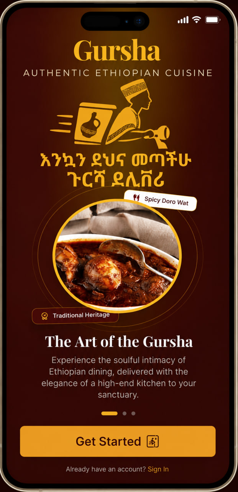
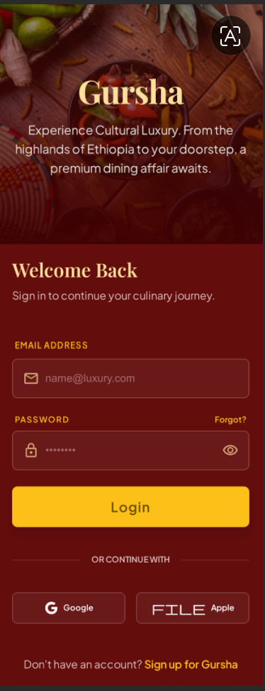

Gursha Delivery 

A beautiful, real-time Flutter mobile food delivery application built using Firebase Authentication and Cloud Firestore.

eatures
- **Splash Screen:** Welcomes users with custom branding.
- **Firebase Authentication:** Secure email and password registration and login flow.
- **Real-time Firestore Menu:** Pulls food items, prices, and descriptions directly from the cloud database.
- **State-managed Cart System:** Customers can add items to their basket, manage quantities, and see their live total bill.
- **Integrated Checkout:** Seamless order submission pushing order structures up to Cloud Firestore.

## Project Structure
This project is built using a clean, scalable folder architecture:

lib/
├── app/                  # Main app configurations
├── constants/            # Global styles, assets, and colors
├── models/               # Food, Cart, and Order data models
├── providers/            # State management (CartProvider)
├── routes/               # App routing configuration
├── screens/              # UI screens (auth, customer, splash, driver, restaurant)
├── services/             # Firebase network connections
└── widgets/              # Reusable custom buttons and textfields

## Tech Stack
- **Frontend Framework:** Flutter & Dart
- **State Management:** Provider
- **Backend Services:** Firebase Auth & Cloud Firestore
- **Database:** NoSQL Cloud Database
  
    App Screenshots
 

  <table>
    <tr>
      <td align="center">
        
         <b>Splash Screen</b>
      </td>
      <td align="center">
        
         <b>Login Screen</b>
      </td>
    </tr>
  </table>

